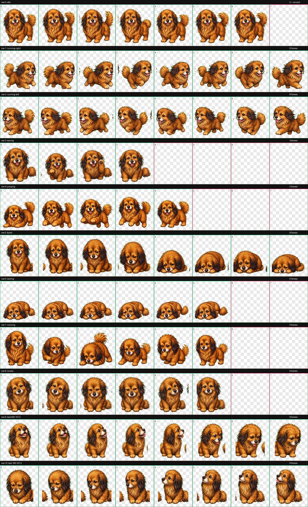

# Feifei Codex Pet

飞飞是一只像素风 Codex 桌面宠物，基于真实小狗飞飞制作。



## Files

- `pet.json` - Codex pet manifest.
- `spritesheet.png` - v2 pet spritesheet, 8 columns by 11 rows.
- `assets/contact-sheet.png` - preview sheet for all generated poses.

## Install

Copy this folder into your Codex pets directory:

```powershell
Copy-Item -Recurse -Force . "$env:USERPROFILE\.codex\pets\feifei"
```

Then restart Codex or reopen the pet picker and choose `飞飞`.

## Notes

- Sprite version: `2`
- Atlas size: `1536x2288`
- Cell size: `192x208`
- Rows include idle, running, waving, jumping, failed, waiting, review, and look-direction poses.
